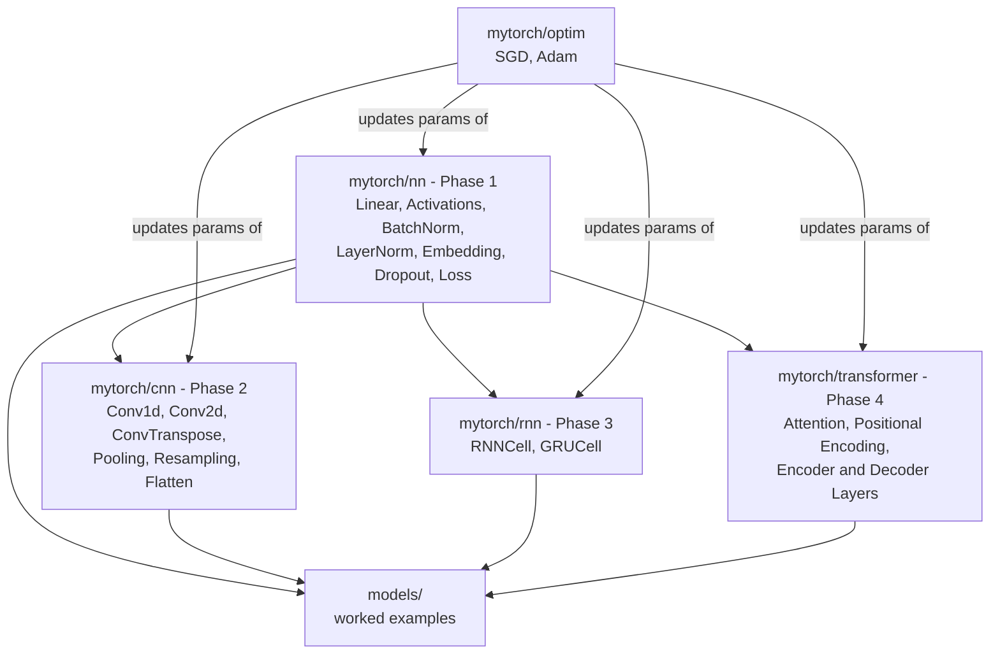
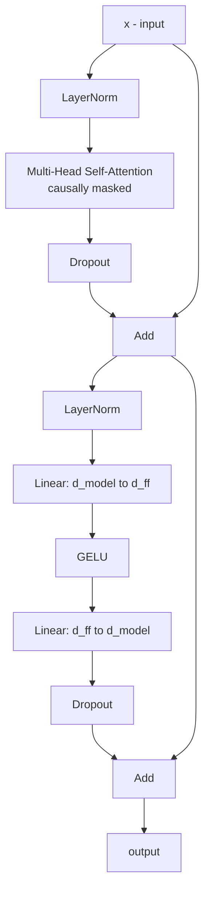

# MyTorch


A deep learning library built from scratch in NumPy (no PyTorch, no autograd). Every `forward()` has a hand-derived `backward()` next to it, and every `backward()` is checked against finite differences before it's trusted. Built across 4 phases: **MLP → CNN → RNN → Transformer**.

## Architecture

Each phase is its own subpackage. Later phases depend on the nn and optim subdirectories which implement all the base features needed for a bare-bones deep learning library.



The most involved piece is the pre-LN Transformer decoder block (`mytorch/transformer/decoder_layers.py`), composed entirely from the layers above it:



## What's implemented

| Component | Forward | Backward | Gradient-checked |
|---|:---:|:---:|:---:|
| **Phase 1 — MLP** | | | |
| `Linear` (arbitrary batch dims) | ✅ | ✅ | ✅ max err `1.6e-11` |
| `Identity` / `Sigmoid` / `Tanh` / `ReLU` | ✅ | ✅ | — |
| `GELU` (exact, via `erf`) | ✅ | ✅ | — |
| `Swish` (learnable β) | ✅ | ✅ | — |
| `Softmax` (arbitrary axis) | ✅ | ✅ | — |
| `BatchNorm1d` | ✅ | ✅ | ✅ max err `7.4e-10` |
| `LayerNorm` | ✅ | ✅ | ✅ max err `6.7e-10` |
| `Dropout` (inverted) | ✅ | ✅ | — |
| `MSELoss` | ✅ | ✅ | ✅ max err `2.3e-10` |
| `CrossEntropyLoss` | ✅ | ✅ | ✅ max err `1.8e-10` |
| `SGD` (momentum, weight decay) | — | — | ✅ regression-matched |
| `Adam` | — | — | ✅ regression-matched |
| **Phase 2 — CNN** | | | |
| `Conv1d` / `Conv1d_stride1` | ✅ | ✅ | ✅ max err `1.6e-9` |
| `Conv2d` / `Conv2d_stride1` | ✅ | ✅ | — |
| `ConvTranspose1d` / `ConvTranspose2d` | ✅ | ✅ | — |
| `MaxPool2d` / `MeanPool2d` | ✅ | ✅ | — |
| `Upsample1d/2d` / `Downsample1d/2d` | ✅ | ✅ | — |
| `Flatten` | ✅ | ✅ | — |
| **Phase 3 — RNN** | | | |
| `RNNCell` | ✅ | ✅ | ✅ max err `3.2e-10` |
| `GRUCell` | ✅ | ✅ | ✅ max err `1.1e-10` |
| **Phase 4 — Transformer** | | | |
| `Embedding` (correct grad accumulation) | ✅ | ✅ | ✅ max err `1.2e-12` |
| `PositionalEncoding` (sinusoidal) | ✅ | n/a | deterministic addition |
| `ScaledDotProductAttention` | ✅ | ✅ | ✅ max err `6.2e-10` |
| `MultiHeadAttention` | ✅ | ✅ | ✅ max err `3.2e-13` |
| `SelfAttentionLayer` / `CrossAttentionLayer` / `FeedForwardLayer` (pre-LN) | ✅ | ✅ | ✅ via full-model check |
| `SelfAttentionEncoderLayer` / `SelfAttentionDecoderLayer` / `CrossAttentionDecoderLayer` | ✅ | ✅ | ✅ via full-model check |
| `PadMask` / `CausalMask` | ✅ | n/a | — |

Numbers above are from the finite-difference sweep described in [Verification methodology](#verification-methodology).

## Worked examples (`models/`)

Each file shows the library composed end-to-end into something trainable using just `mytorch`:

| File | Model | Demonstrates |
|---|---|---|
| `mlp.py` | `MLP0` / `MLP1` / `MLP4` | Basic Linear + ReLU stacks |
| `mlp_scan.py` | `CNN_SimpleScanningMLP` / `CNN_DistributedScanningMLP` | A scanning MLP is mathematically a 1D CNN — same weights, reshaped |
| `cnn.py` | `CNN` | Configurable conv stack → flatten → linear classifier |
| `rnn_classifier.py` | `RNNPhonemeClassifier` | Multi-layer RNN with manual BPTT |
| `char_predictor.py` | `CharacterPredictor` | GRU-based character-level next-step prediction |
| `char_transformer_lm.py` | `CharTransformerLM` | Decoder-only Transformer LM with greedy generation |

## Quickstart

No installation beyond the two dependencies — clone and import:

```bash
pip install -r requirements.txt   # numpy, scipy
```

```python
import numpy as np
from mytorch.nn import Linear, ReLU, CrossEntropyLoss
from mytorch.optim import Adam

class TinyClassifier:
    def __init__(self):
        self.layers = [Linear(20, 32), ReLU(), Linear(32, 4)]

    def forward(self, x):
        for layer in self.layers:
            x = layer.forward(x)
        return x

    def backward(self, dLdOut):
        for layer in reversed(self.layers):
            dLdOut = layer.backward(dLdOut)
        return dLdOut

model = TinyClassifier()
criterion = CrossEntropyLoss()
optimizer = Adam(model, lr=1e-3)

X = np.random.randn(16, 20)
Y = np.eye(4)[np.random.randint(0, 4, 16)]

for step in range(200):
    logits = model.forward(X)
    loss = criterion.forward(logits, Y)
    model.backward(criterion.backward())
    optimizer.step()
```

`Adam`/`SGD` need `model.layers` to be a flat list of the model's leaf sub-layers

## Results: training a Transformer from scratch

`models/char_transformer_lm.py` is the most complete worked example: a decoder-only, causally-masked, character-level language model. Training run through the full stack: `Embedding → PositionalEncoding → N × (SelfAttention → FeedForward) → LayerNorm → Linear → CrossEntropyLoss`, updated with `Adam`.

**Setup:** a 2-layer, 4-head, `d_model=32` model (18,972 parameters) trained on character-level next-token prediction over the pangram *"the quick brown fox jumps over the lazy dog."*, repeated twice as a 94-character corpus sliced into 64 overlapping 25-character training windows. No pretrained weights (the model starts from random init).

| Step | Loss |
|---:|---:|
| 0 | 3.324 |
| 20 | 3.018 |
| 40 | 2.325 |
| 60 | 1.149 |
| 80 | 0.607 |
| 100 | 0.363 |
| 140 | 0.087 |
| 180 | 0.045 |
| 220 | 0.040 |
| 260 | 0.034 |
| 299 | **0.032** |

Loss at initialization (3.32) is close to `ln(28) ≈ 3.33` which is random-guess entropy over the 28-character, confirming the model starts from nothing. It converges to 0.032 within 300 Adam steps.

Greedy generation from a prompt the model was never given as a complete training window:

```
prompt:    the quick brown
generated: the quick brown fox jumps
```

## Verification methodology

Because there is no autograd, every layer above was manually verified the same way:

1. Run `forward()`, then `backward()`, to get the layer's analytical gradient.
2. For each element of each input/parameter, perturb it by `±1e-6` and re-run `forward()`, to get a numerical gradient: `(f(x+ε) − f(x−ε)) / 2ε`.
3. Compare: analytical vs. numerical should agree to within `1e-4` (they typically agree far more tightly, `1e-9`–`1e-13`, since these are float64 double-sided differences).

Composite layers (`MultiHeadAttention`, the pre-LN sublayers, full encoder/decoder layers) are checked the same way at their own boundary, on top of every sub-layer they're built from already being checked individually. This way an error can't hide by cancelling out between two adjacent bugs.

## Repo structure

```
MyTorch/
├── mytorch/
│   ├── nn/           # Phase 1: Linear, activations, norms, embedding, loss, dropout
│   ├── cnn/          # Phase 2: convolution, pooling, resampling, flatten
│   ├── rnn/          # Phase 3: RNNCell, GRUCell
│   ├── transformer/  # Phase 4: attention, positional encoding, encoder/decoder layers
│   └── optim/        # SGD, Adam — layer-convention-agnostic
├── models/           # Worked end-to-end examples built on mytorch
└── requirements.txt
```
## Acknowledgments

I initially started this project to complement my learning while I was self-teaching Carnegie Mellon University's [11-785 Introduction to Deep Learning](https://deeplearning.cs.cmu.edu/) course over the summer. The code in this repository is inspired by 11-785's curriculum.

## License

MIT.
